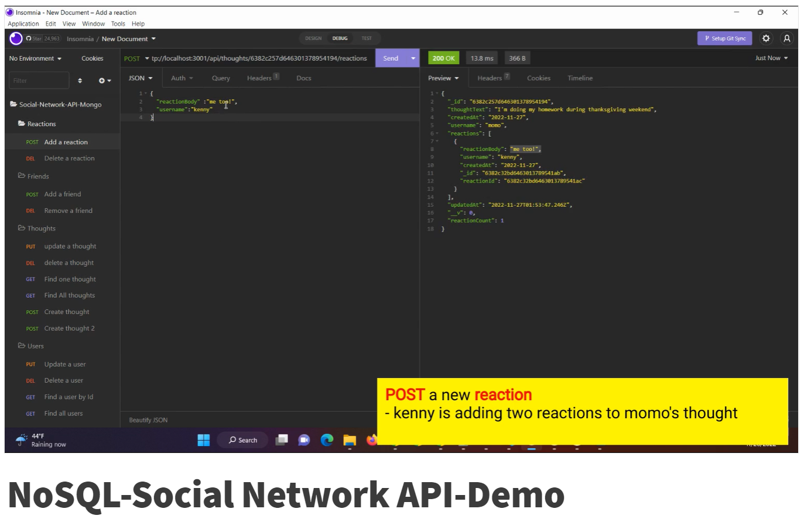

# NoSQL-Social-network-api

This application is an API for a social network web application where users can share their thoughts, react to friends thoughts, and create a friend list. The API is built with Express.js and a MongoDB database, and the Mongoose ODM.

## Table of Contents

- [Installation](#installation)
- [Usage](#usage)
- [Credit](#credit)
- [Questions](#questions)

## Installation
To use this application, you will need Node.js and two other npm packages installed, express, and mongoose. On your desired folder to locate the app, pull down the Repo into your computer by following line on your terminal.

    $ git clone git@github.com:morisky78/Social-network-api.git

Then install the npm package dependencies by following command

    $ npm install

Then, you will see node_modules folder has been created on your folder. 

## Usage
The application's API routes are tested in Insomnia. You can also use MongoDB Compass to make sure the data is stored properly under `snApiDb` database.

The following video shows the demonstration of the functionality of the Social Network API back end, showing the process of retrieve, create, update and delete data of user, thoughts, friends and reactions in your database.
https://watch.screencastify.com/v/X8ZzDmEw4b5iDhd7o1NH

In the video, following functionality and routes are demonstrated in order:
- How to start application server.
- `POST` a new user
- `GET` all users
- `POST` a thought
- `GET` all thoughts
- `POST` a new friend (virtual 'friendCount' updated)
- `GET` a single user 
- `DELETE` a friend
- `POST` a reaction (virtual 'reactionCount' updated)
- `GET` a single thought
- `DELETE` a reaction
- `PUT` to update a thought
- `DELETE` a thought
- `PUT` to update a user (update user info and the username field of user's associated thoughts)
- `DELETE` a user (user data and the user's associated thoughts are deleted)

So, `GET`, `POST`, `PUT`, `DELETE` routes for `users` and `thoughts` are tested to successfully create, retrieve, update, and delete users and thoughts in the database.
And, `POST` and `DELETE` routes for `reactions` and `friends` are tested to successfully create and remove them in the database. 

## Credit
- express
https://www.npmjs.com/package/sequelize

- mongoose
https://mongoosejs.com/

- insomnia
https://docs.insomnia.rest/

- mongoDB Compass
https://www.mongodb.com/try/download/shell

## Questions

If you have any questions, please contact me moran.risk78@gmail.com  
GitHub  profile: [morisky78](https://github.com/morisky78)